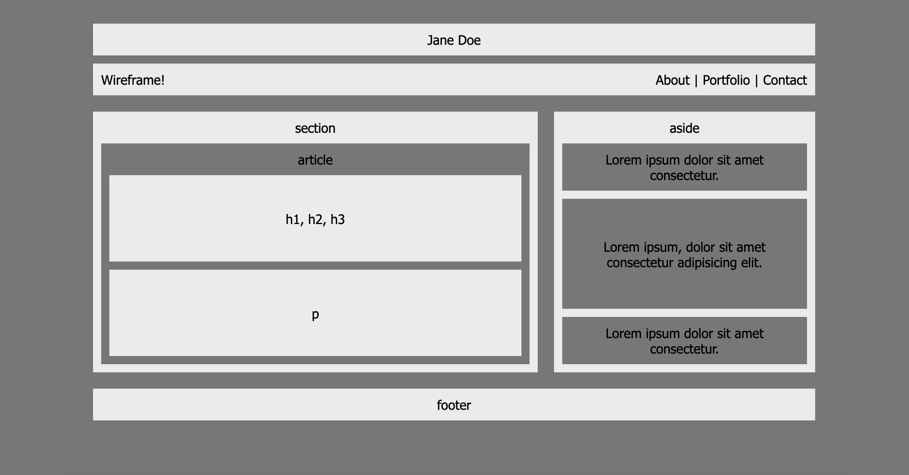

# Flexbox-Wireframe
Apply flexbox properties for wireframe layout

Link: 


## Preview

 

<br>

## Code Snippets
 We want article's child elements (which are two divs) to fill all the available space. We accomplish this by giving each div "flex: 1". But these divs' "flex" properties will only work if their parent element also has the "display: flex" value. So we add that here. 

 Adding "display: flex" will force the divs to awkwardly display in a row, so we add "flex-direction: column" here to force them back to the desired positioning.

````
article {
    display: flex; 
    flex-direction: column; 
    flex: 1; 
}

article div { 
    display: flex; 
    justify-content: center; 
    align-items: center; 
    flex: 1; 
}
````


## Learning Point
The flex CSS property sets how a flex item will grow or shrink to fit the space available in its flex container. For most purposes, authors should set flex to one of the following values: auto, initial, none, or a positive unitless number. 

Link: https://developer.mozilla.org/en-US/docs/Web/CSS/flex

